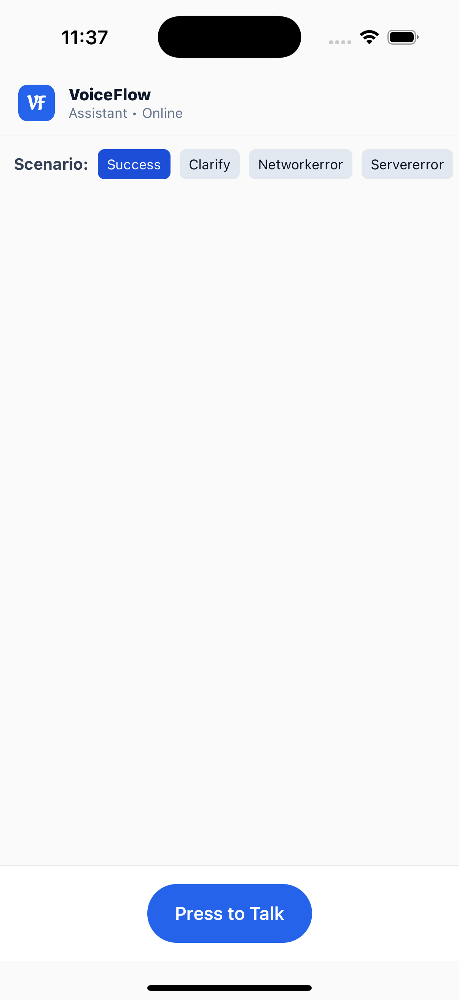
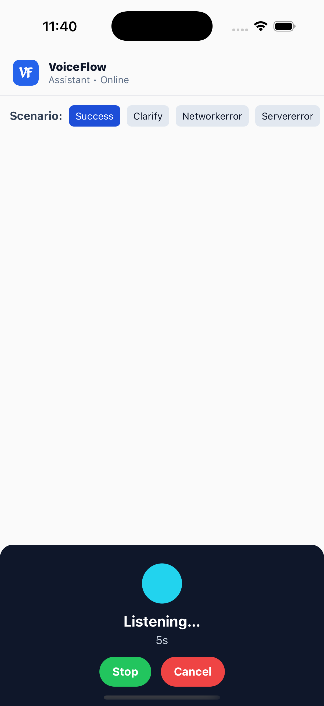
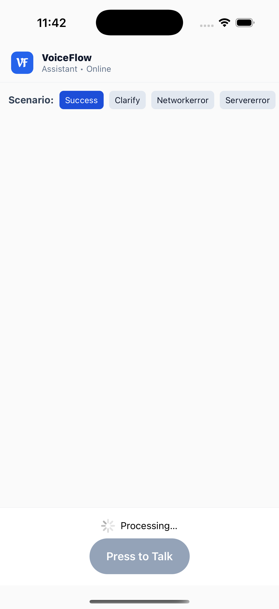
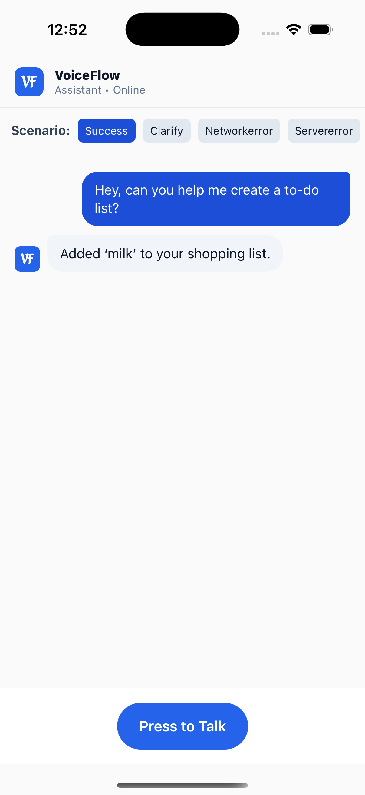
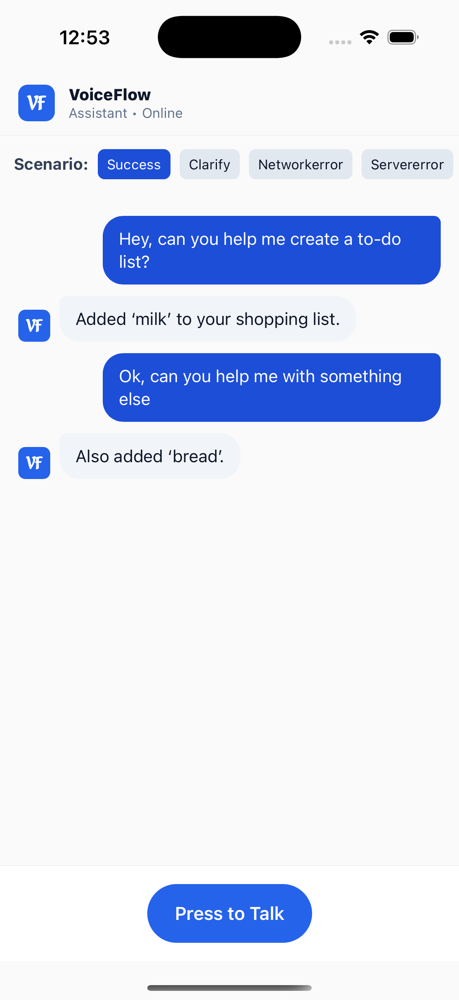
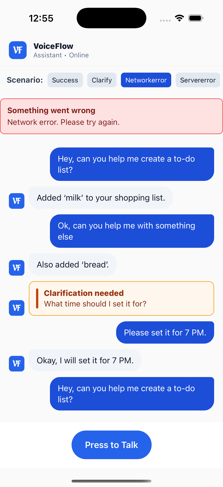
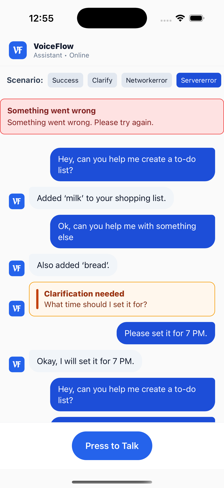

# VoiceFlow - Press-to-Talk Voice Assistant

A React Native Expo application that implements a press-to-talk (PTT) voice capture flow with audio playback. The app records audio locally, processes it through a mocked API, and plays back AI responses using provided audio files.

## Overview

VoiceFlow simulates a voice assistant interaction flow where users:
1. Press a button to start talking
2. Press the Stop button to end recording
3. Wait for the system to process their input (simulated delay)
4. Receive audio playback of the AI's response

The first utterance responds with `audiofile1.mp3`, and the second utterance responds with `audiofile2.mp3`.

## Prerequisites

- **Node.js** (v18 or higher)
- **npm** or **yarn**
- **Expo CLI** (installed globally or via npx)
- **iOS Simulator** (macOS) or **Android Emulator**
- **Expo Go** app (optional, for physical devices)

## Getting Started

### Installation

1. Clone this repository and navigate to the project:
   ```bash
   cd voiceflow
   ```

2. Install dependencies:
   ```bash
   npm install
   ```

### Running the App

#### Option A: Expo Go (simple, your preferred flow)

1) Start the dev server
```bash
npm start
```
2) In the terminal UI, ensure Development client is set to Expo Go
   - If not, press `s` to toggle to Expo Go
3) Launch on a platform
   - iOS Simulator: press `i`
   - Android Emulator: press `a`

Notes:
- You may see a harmless warning about expo-av deprecation; this is expected in Expo Go.
- Make sure your emulator/simulator is running (or a device is connected) before pressing `i`/`a`.

#### Option B: Development Build (no Expo Go)

Use this if you want a native dev client (avoids Expo Go compatibility issues):

- iOS (Simulator):
```bash
npm run ios:simulator
```

- Android (Emulator):
```bash
npm run android:emulator
```

This will:
- Build the native development client
- Install and launch the app directly
- Avoid Expo Go compatibility constraints

#### Physical Device

**Important**: Expo SDK 54 may require the latest version of Expo Go. If you encounter compatibility errors, you have two options:

**Option 1: Using Expo Go (requires latest version)**
1. Install the latest **Expo Go** app from the App Store (iOS) or Google Play Store (Android)
2. Start the development server:
   ```bash
   npm start
   ```
3. Scan the QR code with:
   - **iOS**: Camera app
   - **Android**: Expo Go app

**Option 2: Development Build (recommended for physical devices)**
1. Create a development build:
   ```bash
   npx expo run:ios    # For iOS
   npx expo run:android  # For Android
   ```
2. This builds and installs a native app on your device (no Expo Go needed)

## Architecture Overview

### Folder Structure

```
voiceflow/
├── src/
│   ├── components/      # UI components (PTT button, overlay, transcript display)
│   ├── services/        # AudioService and VoiceApi
│   ├── types/           # TypeScript type definitions
│   └── hooks/           # Custom React hooks
├── assets/
│   └── audio/           # Audio response files (audiofile1.mp3, audiofile2.mp3)
├── App.tsx              # Main application entry point
└── README.md
```

### Core Services

#### AudioService (`src/services/AudioService.ts`)
- **Responsibilities**:
  - Request and manage microphone permissions
  - Start/stop audio recording using `expo-av`
  - Save recorded audio to temporary files (`FileSystem.cacheDirectory`)
  - Playback audio responses
  - Clean up temporary audio files

#### VoiceApi (`src/services/VoiceApi.ts`)
- **Responsibilities**:
  - Mocked API interface for voice processing
  - Simulates network delay (default 1000ms)
  - Returns audio file references instead of transcripts
  - Handles state tracking for first/second utterance

### State Management

The app uses React hooks and context for state management:

**Application States:**
- **Idle**: Initial state, PTT button visible
- **Listening**: User is recording (button pressed)
- **Processing**: Audio recorded, waiting for API response
- **Playing**: Audio response is being played
- **Error**: An error occurred during processing

**State Flow:**
```
Idle → (Press button) → Listening → (Press Stop) → Processing → Playing → Idle
                                                    ↓
                                                  Error → Idle
```

## Scenario Toggling

The app includes a developer control panel (visible in development mode) to test different scenarios:

### Available Scenarios

1. **Success (Default)**: Normal flow - plays audio file 1, then audio file 2
2. **Network Error**: Simulates a network failure
3. **Server Error**: Simulates a server-side error

To toggle scenarios:
- Look for the developer panel at the top of the screen (development mode only)
- Tap the scenario selector to switch between modes

### Scenario Implementation

The `VoiceApi` service tracks utterance count internally:
- First utterance → Returns reference to `audiofile1.mp3`
- Second utterance → Returns reference to `audiofile2.mp3`

### Clarification flow

When the scenario is set to Clarification:
- The first request returns `{ kind: "clarification", prompt: "What time should I set it for?" }` and the app shows a banner.
- The very next PTT utterance completes the turn and returns a normal success with playback and transcript.
- Prior transcripts remain visible; the UI returns to Idle after playback.

## Audio File Lifecycle

### Recording Process

1. **Request Permission**: On first use, the app requests microphone permission
2. **Start Recording**: When the PTT button is pressed, recording starts using `expo-av`
3. **Stop Recording**: On button release, recording stops
4. **Save File**: Audio is saved to `FileSystem.cacheDirectory` with a unique filename
5. **Send to API**: File URI is passed to the mocked `VoiceApi`
6. **Playback**: Response audio file is played using `expo-av` audio player
7. **Cleanup**: Temporary recording files are cleaned up after successful processing

### File Storage

- **Location**: `FileSystem.cacheDirectory` (temporary, OS-managed)
- **Format**: M4A (iOS/Android compatible)
- **Naming**: `recording_${timestamp}.m4a`
- **Cleanup Strategy**:
  - Files are cleaned up immediately after successful processing
  - On app start, files older than 24 hours are removed
  - Failed recordings are removed when a new recording starts

## Key Features

### Press-to-Talk (PTT)

- **Press**: Start recording immediately
- **Stop**: Press the Stop button to finish and process
- **Cancel**: Available during recording to discard and return to Idle

### Visual States

- **Idle**: PTT button prominently displayed
- **Listening**: 
  - Capture overlay/sheet with pulsing animation
  - Timer showing recording duration
  - Cancel button
- **Processing**: 
  - Loading indicator
  - "Processing..." message
- **Playing**:
  - Playback indicator
  - Visual feedback that audio is playing
- **Error**:
  - User-friendly error message
  - Retry button

### Error Handling

- **Permission Denied**: 
  - Graceful message explaining why microphone access is needed
  - Button to retry permission request
- **Network Error**: 
  - "Couldn't connect. Please try again."
  - App returns to Idle state
- **Server Error**: 
  - "Something went wrong. Please try again."
  - App returns to Idle state

## Technical Details

### Technology Stack

- **Framework**: Expo (Managed Workflow)
- **Language**: TypeScript
- **React Native**: 0.81.5
- **Audio**: `expo-av` for recording and playback
- **File System**: `expo-file-system` for file management

### Platform Compatibility

- ✅ iOS Simulator
- ✅ Android Emulator
- ✅ Physical iOS devices
- ✅ Physical Android devices

## Development Notes

### Trade-offs and Decisions

1. **Audio Format**: Using M4A format for maximum iOS/Android compatibility
2. **State Management**: Using React hooks and context API for simplicity (could be migrated to Zustand/Redux for larger apps)
3. **File Cleanup**: Simple cleanup on app start and after processing (no complex lifecycle management)
4. **Permission Handling**: Just-in-time permission requests for better UX
5. **Mock API**: Simple stub class instead of MSW or Apollo to keep it lightweight

### Testing

The app is structured to support unit tests:
- `src/services/` - Service classes can be unit tested
- `src/hooks/` - Custom hooks can be tested with React Testing Library
- Component tests can be added for UI components

## Submission Requirements

✅ **GitHub Repository**: Complete source code with proper structure  
✅ **README**: This comprehensive documentation  
✅ **Demo Video**: 2-3 minute video demonstrating:
   - Press-to-talk recording flow
   - First utterance → plays audiofile1.mp3
   - Second utterance → plays audiofile2.mp3
   - Cancel functionality
   - Error handling (if applicable)
   - Visual state transitions

## Demo script (suggested checklist for your recording)

1) Happy path
- Tap Press to Talk → say “Add milk to my list” → Stop
- Processing shows → Audio plays (audiofile1)
- Transcript card appears

2) Second turn
- Tap Press to Talk → say “Add bread too” → Stop
- Processing shows → Audio plays (audiofile2)
- Transcript updates

3) Clarification scenario
- Switch scenario to Clarification (top toggle)
- Tap Press to Talk → say “Set a reminder” → Stop
- App shows “What time should I set it for?” banner
- Tap Press to Talk → say “7 PM” → Stop → Plays success audio

4) Error handling
- Switch scenario to Network Error → do one turn → friendly message shown → app returns to Idle
- Switch scenario to Server Error → do one turn → friendly message shown → app returns to Idle

5) Cancel
- Tap Press to Talk → overlay shows → tap Cancel → return to Idle (no processing)

Tip: Keep each segment short, show state transitions clearly.

## Screenshots

Add images to `assets/screens/` and reference them here. Examples:










You can capture from the simulator/emulator and drop PNGs in that folder. Keep filenames lowercase with no spaces.

## Video guide / Demo link

Add your 2–3 minute demo video link here:

- Demo video: https://drive.google.com/file/d/1cIEPNbys3_cayJ1Wa-99WOhvruLd75fy/view?usp=sharing
- (Optional) Assignment video guild and instructions: https://www.loom.com/share/b72e9a943e454a5fa19357a665ddc646 and https://doc.clickup.com/9015599350/d/h/8cny87p-69855/bb52a83b03aa3e5/8cny87p-27795

## Analytics (lightweight)

The app logs key events to the console for the demo:
- recording_started, recording_stopped, api_result, playback_started, playback_finished, error

You can view them in the Metro logs or device logs while recording the demo.

## Optional tests

Given the time-boxed assignment, tests are optional. If you’d like to add one:
- Prefer testing pure logic (e.g., a hook’s state transitions) with a simple unit test.
- UI/recording integration tests are heavier and not required here.

## Troubleshooting

### Expo Go Compatibility Error

**Error**: "Project is incompatible with this version of Expo Go"

**Cause**: Expo SDK 54 requires the latest version of Expo Go app.

**Solutions**:

1. **Update Expo Go** (if using physical device):
   - Go to App Store (iOS) or Google Play Store (Android)
   - Update Expo Go to the latest version
   - Try again

2. **Use Development Build** (Recommended):
   ```bash
   # For iOS Simulator
   npm run ios:simulator
   
   # For Android Emulator  
   npm run android:emulator
   
   # For Physical iOS device
   npx expo run:ios
   
   # For Physical Android device
   npx expo run:android
   ```
   This builds a native app that doesn't require Expo Go.

3. **Ensure Simulator is Selected**:
   - When running `npm run ios`, make sure an iOS Simulator is open
   - Disconnect any physical devices if you want to use the simulator
   - The simulator doesn't require Expo Go

### Microphone Permission Issues

If the app doesn't request microphone permission:
- Check that permissions are set in `app.json`
- Reset the app permissions in iOS Settings / Android Settings
- Rebuild the app (may require a full rebuild for native permissions)

### Audio Playback Issues

- Ensure audio files are present in `assets/audio/`
- Check that device/simulator volume is not muted
- Verify `expo-av` is properly installed

### Build Issues

- Clear cache: `npx expo start -c`
- Reinstall dependencies: `rm -rf node_modules && npm install`

## License

Private project for interview assignment.

## Contact

For questions or issues, please contact the repository maintainer.

